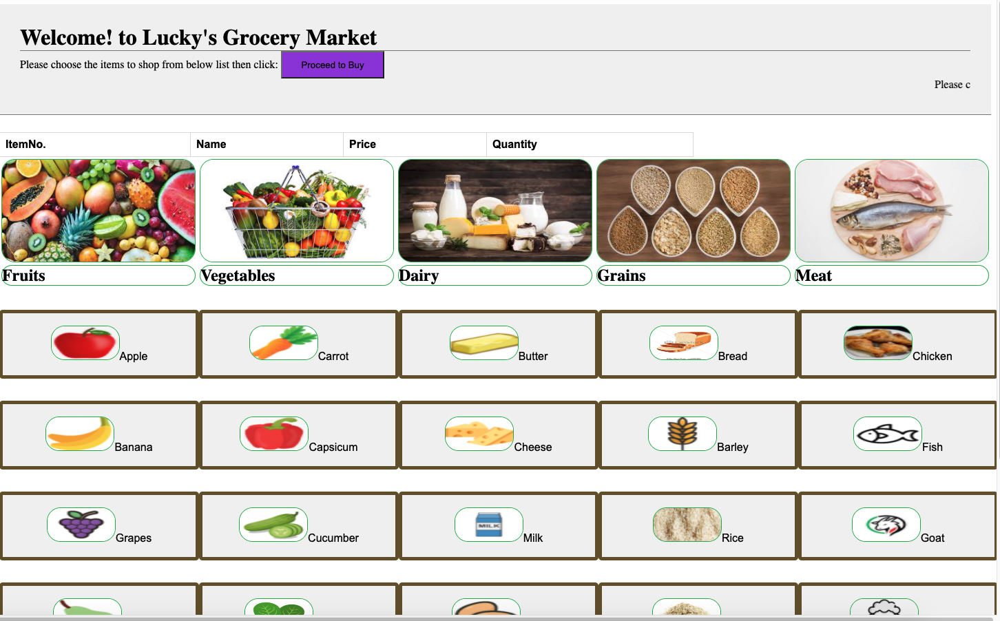
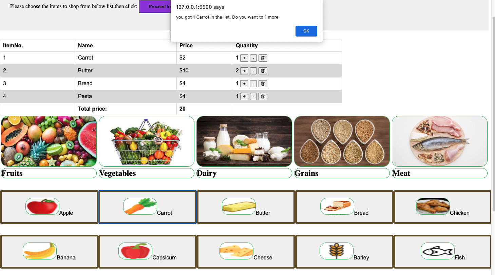
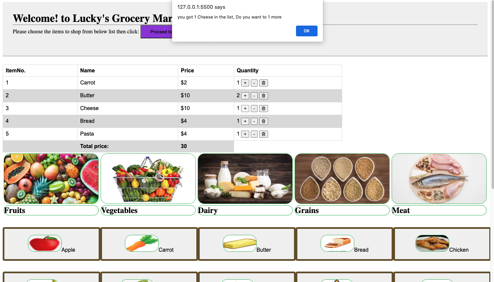

# Project1-GroceryList
### Technologies: HTML, CSS, JavaScript and jQuery
## Project setup
Installation - clone this repo and open in VS code then 
1. Right click on index.html ....> Open with live server   or
2. Right click on index.html ....> Reveal in Finder...> opens that particular folder where index.html is .....> right click on index.html ...> open with..browser

## Project Output
Its open up a page in the browser like this

This is grocery market page, with 5 categories of groceries.

In each category there are 5 items for user to choose.

When user choose an item by clicking on the item on page it displays that item with Item number,name, price, and quantity on page. It also gives total price of selected items. 

After selecting individual items, user can increse, decrease or delete items by clicking on +, - and delete icon respectively.(It prompts an alert message when user clicks on any one of these, to give a friendly message to user)

After finishing, grocery list to shop user has to click on CheckOut button. (it just prompts thank you when user cheks out)

